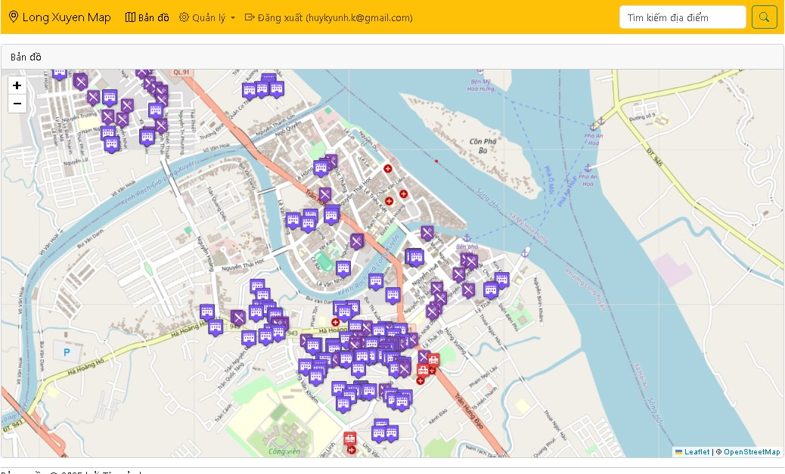

# Long Xuyen Map Website - Interactive Location Visualizer

---

## Introduction

The **Long Xuyen Map Website** is a dynamic and interactive web application designed to visualize key locations within Long Xuyen City, An Giang Province, Vietnam. Built with a focus on modern web technologies, this project leverages **Leaflet.js** for interactive map rendering and **Firebase Firestore** as its flexible, cloud-based NoSQL database for managing location data. The website allows users to explore various points of interest, such as hotels, hospitals, and restaurants, displayed as custom markers on a detailed map. It's an excellent example of a client-side web application powered by a NoSQL cloud database.

---

## Live Demo

Experience the map live!
[https://angiang-map.web.app/](https://angiang-map.web.app/)

---
## Visual Setup Guide

### Home Page
<p align="center">
  
  </br>
    <em>Home Page Long Xuyen Map</em>
</p>
<p align="center">
  
  </br>
    <em>Location Manage</em>
</p>
<p align="center">
  
  </br>
    <em>Location Type Manage</em>
</p>
---

## Key Features

This interactive map application offers a range of features to enhance user experience and data visualization:

* **Interactive Map Display:** Powered by **Leaflet.js**, the website presents a highly interactive map interface centered on Long Xuyen. Users can pan, zoom, and explore the geographical area seamlessly.
* **Dynamic Location Markers:** Points of interest are rendered as **custom markers** on the map. These markers are dynamically fetched from Firebase Firestore, ensuring that the map always displays up-to-date information.
* **Categorized Location Types:** Locations are categorized (e.g., hotels, hospitals, restaurants), and each category is represented by a **unique custom icon**. This visual distinction helps users quickly identify different types of establishments.
* **Detailed Pop-up Information:** Clicking on a marker reveals a **pop-up window** displaying essential information about the location, including its name and address, providing immediate context to the user.
* **Cloud-based Data Management (Firebase Firestore):** All location data (including coordinates, names, addresses, and types) is stored and retrieved from **Firebase Firestore**. This provides a robust, scalable, and real-time database solution, allowing for easy updates and management of map data.
* **Modular Web Structure:** The website utilizes a modular HTML structure with reusable components like navigation bars (`navbar.html`) and footers (`footer.html`), loaded dynamically using jQuery. This promotes cleaner code and easier maintenance.
* **Responsive Design:** Built with **Bootstrap 5.3.3**, the website ensures a responsive and consistent user experience across various devices, from desktops to mobile phones.
* **Client-Side Data Fetching:** Location data is directly fetched and rendered on the client-side using JavaScript, minimizing server load and providing a snappy user experience.

---

## Technologies Used

The Long Xuyen Map Website is built using a combination of popular frontend libraries and a powerful backend-as-a-service solution:

* **Frontend Development:**
    * **HTML5:** The foundational language for structuring the web content.
    * **CSS3 (Bootstrap 5.3.3):** Utilized for modern and responsive styling, ensuring the application looks great on any device. It provides a robust grid system, pre-built components, and utility classes.
    * **JavaScript:** The primary language for interactive functionality, including fetching data, manipulating the DOM, and integrating with mapping libraries.
    * **jQuery 3.7.1:** A fast, small, and feature-rich JavaScript library used for simplified DOM manipulation and event handling, particularly for loading partial HTML components.
    * **Bootstrap Icons 1.11.3:** Provides a set of open-source SVG icons that can be easily integrated into the web pages for visual enhancement.
* **Mapping Library:**
    * **Leaflet.js 1.9.4:** A leading open-source JavaScript library for mobile-friendly interactive maps. It's lightweight, highly customizable, and provides all the core features needed for displaying tiled maps and markers.
    * **OpenStreetMap (OSM) Tiles:** The base map imagery is sourced from OpenStreetMap, providing detailed and up-to-date geographical data.
* **Database & Cloud Services:**
    * **Firebase Firestore:** A flexible, scalable NoSQL cloud database provided by Google Firebase. It's used to store and synchronize data in real-time, specifically for managing location details (`diadiem` collection) and location types (`loai` collection).
    * **Firebase SDK (v11.3.1):** The JavaScript SDK for Firebase, used to interact with Firestore, fetching documents and collections.
    * **Firebase Hosting:** The project is deployed using Firebase Hosting, which provides fast, secure, and reliable hosting for web applications.

---

## How It Works (Detailed Breakdown)

The application operates entirely client-side, fetching data and rendering the map dynamically:

1.  **Initial Load:**
    * `index.html` loads the main page structure, including Bootstrap CSS/JS, jQuery, and Leaflet CSS/JS.
    * jQuery is used to asynchronously load `inc/navbar.html` and `inc/footer.html` into the respective `div` elements, creating a consistent layout.
2.  **Firebase Initialization:**
    * A module script (`inc/config.js` - though not provided, it's expected to contain your Firebase project configuration) initializes the Firebase app.
    * The `getFirestore()` function from the Firebase SDK is used to get a reference to the Firestore database.
3.  **Data Fetching:**
    * The `getDanhSachDiaDiem()` asynchronous function is defined globally. This function:
        * Queries the `diadiem` (locations) collection in Firestore using `getDocs()`.
        * For each location document, it asynchronously fetches the corresponding `Loai` (type) document using `getDoc()` based on the `MaLoai` reference stored within the location data.
        * It uses `Promise.all()` to efficiently wait for all location and type data to be fetched before returning the complete list of enriched location objects.
4.  **Map Initialization:**
    * When the DOM is ready (`$(function(){...})`), a Leaflet map is initialized in the `div` with `id="bando"`.
    * It's centered on approximate coordinates for Long Xuyen (`10.378402685002266, 105.43956802244288`) with an initial zoom level of 15.
    * OpenStreetMap tiles are added as the base map layer.
5.  **Marker Rendering:**
    * After `getDanhSachDiaDiem()` successfully returns the list of locations:
        * The code iterates through each `diaDiem` object.
        * Based on `d.Loai.MaLoai` (1 for hotel, 2 for hospital, otherwise restaurant), a specific marker image (`images/hotel.png`, `images/hospital.png`, `images/restaurant.png`) is selected for the `L.icon` definition.
        * A Leaflet `L.marker` is created at the location's `latitude` and `longitude` (`d.ToaDo.latitude`, `d.ToaDo.longitude`) with the chosen custom icon.
        * A `popupContent` string is constructed using the location's name (`d.TenDiaDiem`) and address (`d.DiaChi`).
        * A Leaflet `L.popup` is created with this content and bound to the marker using `marker.bindPopup(popup)`.
        * Finally, the marker is added to the map using `marker.addTo(bando)`.

---

## Local Development Setup

To run and contribute to this project locally, follow these steps:

1.  **Clone the Repository:**
    ```bash
    git clone https://[https://github.com/hkhuang07/Long-Xuyen-Map-Website-Firesbase/](https://github.com/hkhuang07/Long-Xuyen-Map-Website-Firesbase/)
    cd Long-Xuyen-Map-Website-Firesbase
    ```

2.  **Firebase Project Setup:**
    * **Create a Firebase Project:** Go to the [Firebase Console](https://console.firebase.google.com/) and create a new project.
    * **Enable Firestore:** In your Firebase project, navigate to "Firestore Database" and create a new database. Choose "Start in production mode" or "Start in test mode" (adjust security rules later for production).
    * **Create Collections:**
        * Create a collection named `diadiem` (locations). Each document in this collection should have fields like `TenDiaDiem` (string), `DiaChi` (string), `ToaDo` (GeoPoint, with `latitude` and `longitude`), and a `MaLoai` (document reference to a `loai` document).
        * Create a collection named `loai` (types). Each document should have fields like `MaLoai` (number, e.g., 1, 2, 3), `TenLoai` (string, e.g., "Khách sạn", "Bệnh viện", "Nhà hàng"). Ensure `MaLoai` in `diadiem` documents correctly points to these documents in the `loai` collection.
        * **Example `diadiem` document:**
            ```json
            {
              "TenDiaDiem": "Khách sạn Hạnh Phúc",
              "DiaChi": "123 Đường Trần Hưng Đạo",
              "ToaDo": { "latitude": 10.3785, "longitude": 105.4396 },
              "MaLoai": "loai/SOME_DOC_ID_FOR_HOTEL" // Replace with actual doc ID
            }
            ```
        * **Example `loai` document (for hotels):**
            ```json
            // Document ID: SOME_DOC_ID_FOR_HOTEL
            {
              "MaLoai": 1,
              "TenLoai": "Khách sạn"
            }
            ```
    * **Get Firebase Config:** In your Firebase project settings (Project overview -> Project settings -> General -> Your apps), add a web app if you haven't already. Copy the Firebase SDK config object (it will look like `{ apiKey: "...", authDomain: "...", projectId: "...", ... }`).
    * **Create `inc/config.js`:** In your project's `inc/` directory, create a new file named `config.js` and paste your Firebase config object into it, exporting it:
        ```javascript
        // inc/config.js
        import { initializeApp } from '[https://www.gstatic.com/firebasejs/11.3.1/firebase-app.js](https://www.gstatic.com/firebasejs/11.3.1/firebase-app.js)';

        const firebaseConfig = {
            apiKey: "YOUR_API_KEY",
            authDomain: "YOUR_AUTH_DOMAIN",
            projectId: "YOUR_PROJECT_ID",
            storageBucket: "YOUR_STORAGE_BUCKET",
            messagingSenderId: "YOUR_MESSAGING_SENDER_ID",
            appId: "YOUR_APP_ID"
        };

        // Initialize Firebase
        const app = initializeApp(firebaseConfig);
        export default app; // Export the app instance
        ```
        **Note:** The provided HTML uses `getFirestore, collection, getDocs, getDoc` directly from `firebasejs/11.3.1/firebase-firestore.js` and `firebase-app.js`. Ensure these versions align or adjust imports accordingly. The above `config.js` structure assumes a modular import.

3.  **Serve Locally:**
    Since this is a static website, you'll need a local web server.
    * **Using `serve` (recommended):** If you have Node.js installed, you can install `serve` globally:
        ```bash
        npm install -g serve
        ```
        Then, from your project's root directory, run:
        ```bash
        serve .
        ```
    * **Using Python's HTTP server:**
        ```bash
        python -m http.server 8000
        ```
    * **Using VS Code Live Server extension:** If you use VS Code, the "Live Server" extension provides a convenient way to launch a local server.

4.  **Access the Application:**
    Open your web browser and navigate to the address provided by your local server (e.g., `http://localhost:5000` or `http://localhost:8000`).

---

## Deployment to Firebase Hosting

This project is perfectly suited for free deployment using **Firebase Hosting**.

1.  **Install Firebase CLI:** If you haven't already, install the Firebase CLI globally:
    ```bash
    npm install -g firebase-tools
    ```

2.  **Login to Firebase:**
    ```bash
    firebase login
    ```
    Follow the prompts in your browser to authenticate with your Google account.

3.  **Initialize Firebase Project (if not already):**
    From your project's root directory:
    ```bash
    firebase init
    ```
    * Select **"Hosting: Configure files for Firebase Hosting and (optionally) set up GitHub Action deploys"**.
    * Choose your existing Firebase project when prompted.
    * For "What do you want to use as your public directory?", enter `.` (a single dot), as your HTML files are in the root.
    * For "Configure as a single-page app (rewrite all URLs to /index.html)?", type `No`.
    * For "Set up automatic builds and deploys with GitHub?", you can choose `No` for a manual deploy, or `Yes` if you want CI/CD.

4.  **Deploy the Website:**
    Once initialized, deploy your project:
    ```bash
    firebase deploy
    ```
    Firebase CLI will upload your files and provide you with the live URL (e.g., `https://your-project-id.web.app/`).

---

## Authors

This project was developed with guidance and contributions from:

* **Mentor:** Nguyen Hoang Tung
* **Student:** Huynh Quoc Huy
    * [GitHub Profile: hkhuang07](https://github.com/hkhuang07/)

---

## Repository

The full source code for the Long Xuyen Map Website is available on GitHub:
[Long-Xuyen-Map-Website-Firebase](https://github.com/hkhuang07/Long-Xuyen-Map-Website-Firesbase/)

---

## License

*(Add your license information here, e.g., MIT License, if applicable. A `LICENSE` file in your repo is recommended.)*

---
